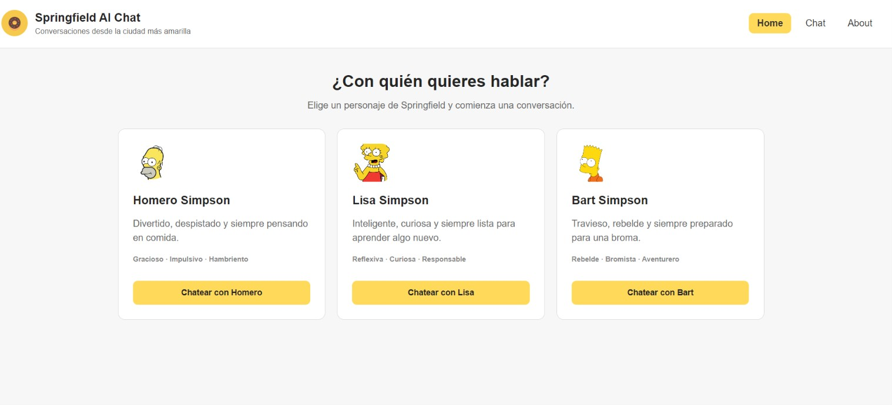
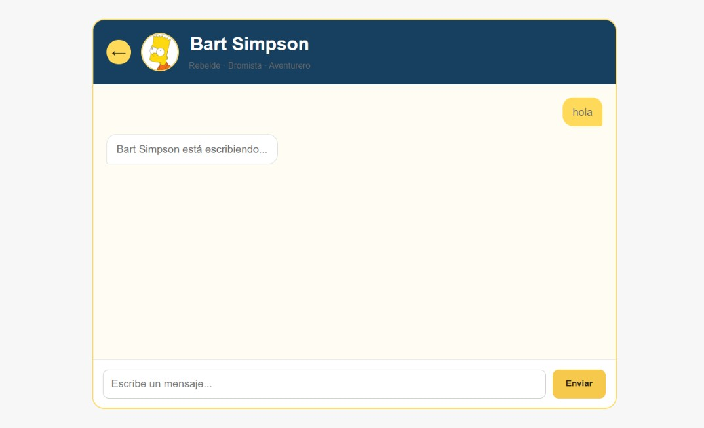
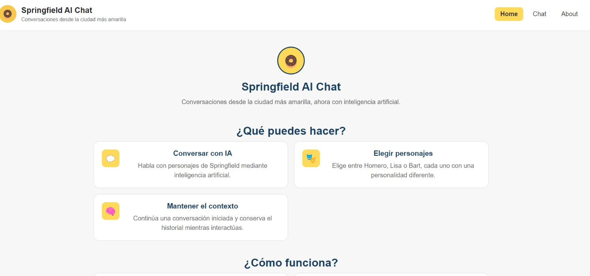

# Springfield AI Chat 🍩

## 1. Descripción del personaje elegido

La aplicación permite conversar con personajes de Springfield utilizando Google Gemini AI.

Los personajes disponibles son:

- **Homero Simpson:** divertido, despistado, impulsivo y amante de la comida.
- **Lisa Simpson:** inteligente, curiosa, reflexiva y responsable.
- **Bart Simpson:** travieso, rebelde, bromista y aventurero.

Cada personaje cuenta con un prompt diferente para adaptar las respuestas de Gemini a su personalidad.


## 2. Requisitos y ejecución local

### Requisitos

- Node.js
- npm
- Vercel CLI
- API Key de Google Gemini

### Instalar dependencias

Clonar el repositorio:

```bash
git clone https://github.com/lupevillena/ProyectoM3_GuadalupeVillena.git
```

Entrar al proyecto:

```bash
cd ProyectoM3_GuadalupeVillena/springfield-ai-chat
```

Instalar las dependencias:

```bash
npm install
```

### Configurar `.env`

Crear un archivo `.env.local` en la raíz del proyecto:

```text
GEMINI_API_KEY=tu_api_key
```

La API key debe mantenerse privada y `.env.local` no debe subirse a GitHub.

### Ejecutar localmente

Ejecutar:

```bash
vercel dev
```

Abrir en el navegador:

```text
http://localhost:3000
```


## 3. Cómo ejecutar los tests

El proyecto utiliza Vitest.

Ejecutar:

```bash
npm test
```

El proyecto cuenta con 4 tests unitarios.


## 4. Cómo desplegar a Vercel

El proyecto está configurado para utilizar Vercel.

Para realizar un despliegue desde la terminal:

```bash
vercel --prod
```

También es necesario configurar la variable de entorno:

```text
GEMINI_API_KEY
```

en el entorno **Production** de Vercel.


## 5. Capturas de pantalla

### Página principal



### Chat funcionando



### About 



---

## 6. Link a la aplicación desplegada

Aplicación:

https://springfield-ai-chat.vercel.app

Repositorio:

https://github.com/lupevillena/ProyectoM3_GuadalupeVillena


## 7. Registro del uso de AI en el proyecto

Durante el desarrollo del proyecto se utilizó inteligencia artificial como herramienta de asistencia.

La inteligencia artificial fue utilizada para:

- Asistir en la planificación y estructura del proyecto.
- Ayudar en la integración de Google Gemini.
- Asistir en la implementación de la Serverless Function.
- Diseñar y revisar los prompts de personalidad de los personajes.
- Ayudar a identificar y solucionar errores de configuración de Vercel.
- Revisar el manejo de errores.
- Ayudar en la creación y revisión de tests unitarios con Vitest.
- Asistir en la documentación del proyecto.

## Capturas del uso de AI

Durante el desarrollo del proyecto se utilizó ChatGPT como herramienta de apoyo para resolver dudas relacionadas con la implementación, el diseño de la interfaz y el uso de Git y GitHub.

### Incorporación de imágenes de los personajes

Se solicitó ayuda para incorporar las imágenes de los personajes almacenadas dentro del proyecto y mostrarlas en la página principal, ubicándolas junto a la información correspondiente.


### Corrección del diseño de la pestaña Chat

Después de realizar cambios en la interfaz, algunos estilos CSS comenzaron a afectar los elementos de la pestaña Chat, provocando texto superpuesto y una distribución incorrecta. Se revisaron las reglas CSS para corregir esta sección sin modificar el diseño de la página principal.


### Ajuste del tamaño de las imágenes

Al modificar el tamaño de las imágenes de los personajes en la pestaña Chat, algunos elementos de la interfaz cambiaron de posición. Se revisaron los estilos específicos de esta sección para ajustar las imágenes sin afectar el resto del diseño.


### Actualización del proyecto en GitHub

Se utilizó asistencia para recordar el proceso necesario para guardar y publicar los cambios realizados en el proyecto mediante Git, utilizando comandos como `git status`, `git add`, `git commit` y `git push`.


### Manejo de errores de la API de Gemini

Durante las pruebas del Chat se analizaron los códigos de error de la API de Gemini. Se identificó la diferencia entre el error `503 UNAVAILABLE`, relacionado con una indisponibilidad temporal del servicio, y el error `429 RESOURCE_EXHAUSTED`, relacionado con alcanzar una cuota o límite de solicitudes.


## 8.Seguridad

La API key de Gemini se almacena mediante una variable de entorno.

El archivo:

```text
.env.local
```

no se incluye en el repositorio.

El archivo `.gitignore` contiene reglas para evitar que las credenciales y archivos sensibles sean subidos accidentalmente a GitHub.

La comunicación con Gemini se realiza desde el backend mediante una Serverless Function.


# 9. Autor

**Guadalupe Villena**

Proyecto desarrollado como parte del Proyecto M3.